# Dhaka Road Topology Pipeline

Class project (CSE, BUET) on **topology-aware transport policy targeting**: decomposing
Dhaka's road network into zones, measuring their structure, and identifying which
intersections matter and *why they matter differently in different places*.

This README is the full account — what was asked, what came out, how it was established,
and where it is weak. The running log of every experiment is in
[`experiments/EXPERIMENTS.md`](experiments/EXPERIMENTS.md); the figures below are in
[`results/figures/`](results/figures/).

---

## The question, and what happened to it

The project set out to sort Dhaka's zones into **four morphological archetypes** — Grid,
Maze, Radial Corridor, Periphery — and use that label to condition an intersection-level
criticality ranking. Clustering on 26 topology features never produced four types. It
produced two, weakly, and the independent geometric method didn't agree with it.

The work below is what happened when that null result was treated as a question rather
than a conclusion.

---

## Findings

### 1. The typology failed because of the *analysis unit*, not the city

Four 2 km zones were selected as unambiguous examples of two morphological types, rendered
at fixed scale, and their spatial frequency spectra compared. The spectra are nearly
identical — and the images show why.

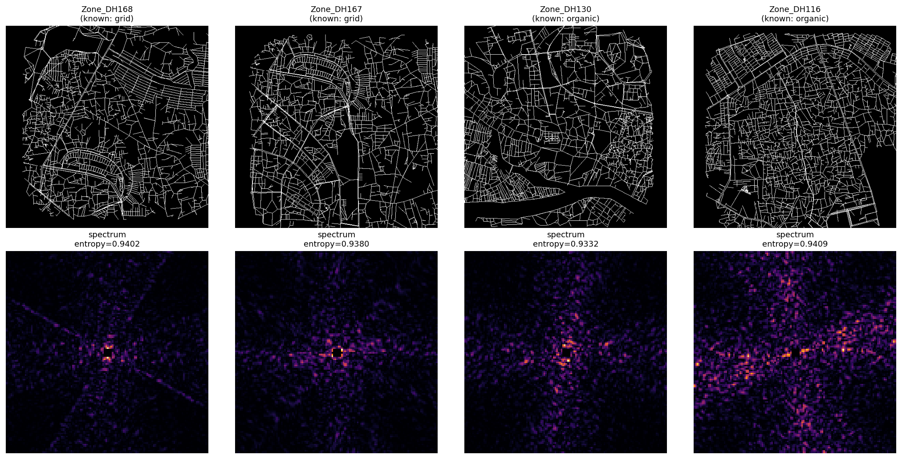

**None of the four zones is a grid or an organic network.** Each is a mixture of regular
blocks and irregular fabric. The zone labelled "organic" visibly contains the most grid
structure of the four. A zone-level morphology label is therefore **not a badly estimated
quantity but a poorly defined one** — there is no single morphology in a 2 km zone for a
label to refer to.

Quantified over all 224 zones at 400 m resolution: **within-zone morphological variation
is 2.0× the between-zone variation**.

### 2. At 400 m, the structure is measurable

A grid is not merely *oriented* — it is oriented in two perpendicular directions at once
(a single arterial road is strongly oriented and is not a grid). Measuring that from
length-weighted street bearings gives a score that is rotation-invariant by construction:
a grid tilted 30° from north scores identically to one aligned with it.

Before applying it, the measure was tested against synthetic patterns whose morphology is
known by construction. **Three of eight claims about it were wrong**, including one of
mine, and were corrected before anything was built on them.

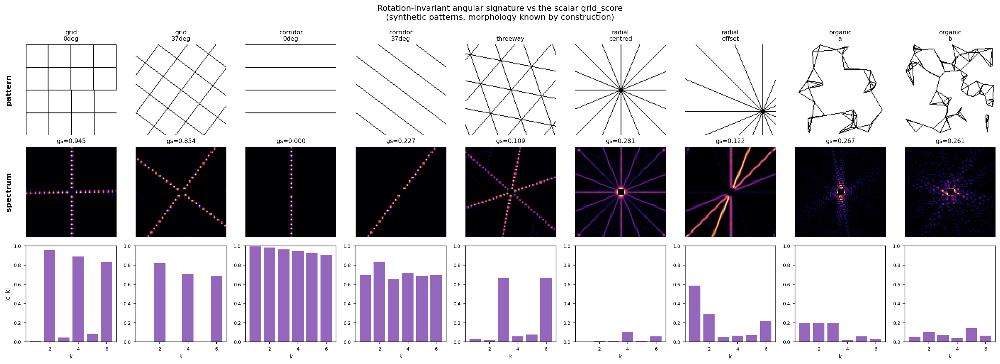

| Claim | Outcome |
|---|---|
| The score is rotation-invariant | **Failed as implemented** — rendering to a raster destroyed it (spread 0.225). Computing from vector geometry gives exactly 1.0000 at every rotation. |
| The 2nd harmonic \|c₂\| identifies a grid | **Wrong** — a corridor scores \|c₂\|=0.983 vs a grid's 0.953. \|c₁\| is the discriminator. |
| Radial is recoverable from the angular signature | **Wrong** — a centred hub looks isotropic, an off-centre hub looks like a corridor. Radial needs a spatial measure; **only three of the four archetypes are addressable here.** |

Sanity check before trusting any number — highest- vs lowest-scoring patches:

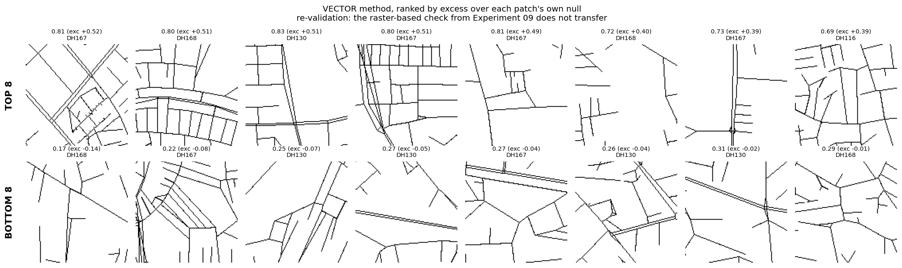

### 3. Dhaka's morphology, mapped at 400 m

89,600 sliding windows across all 224 zones, computed in 16 seconds. 60,460 carry enough
road to score.

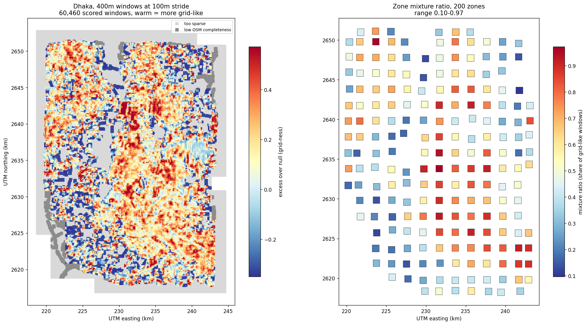

A coherent grid-like spine runs north–south through the centre-east, against cooler
organic fabric to the west.

**But a city-wide scatter says little about any particular place.** Every zone also has
its own sheet: the 2 km core split into a 5×5 lattice of 400 m subgrids, each tinted and
scored, with those same 25 subgrids drawn individually alongside so the fabric of each
part is legible on its own.

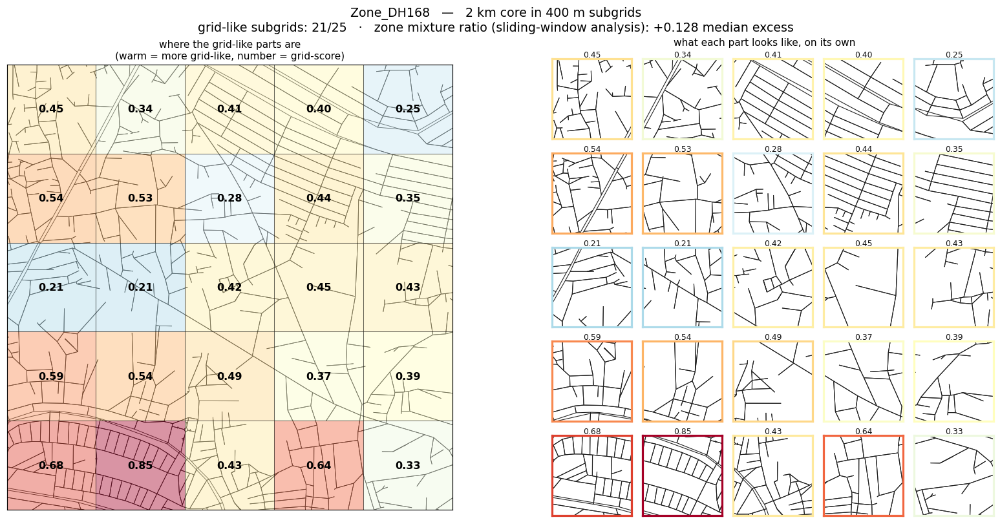

All 224 zones at their real grid positions — the index is itself a map of Dhaka:

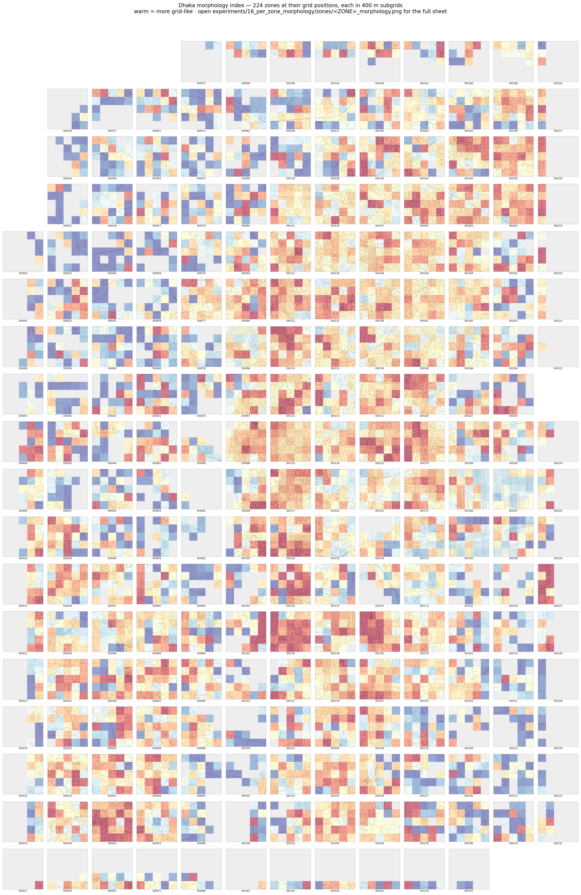

```bash
python experiments/16_per_zone_morphology/run.py    # regenerates all 224 sheets (~3.5 min)
python experiments/16_per_zone_morphology/make_index.py
```

The 224 sheets (54 MB) are gitignored; the index and one example are tracked.

### 4. Density is the confound that keeps coming back

The zone-level result initially correlated with node density at **+0.72** — enough to
explain it entirely. Two corrections were needed, and the first was our own doing:
defining the measure as "fraction of windows above a significance threshold" imports
*statistical power* into it, because denser windows pass more easily regardless of shape.
Removing the threshold dropped the correlation to +0.51.

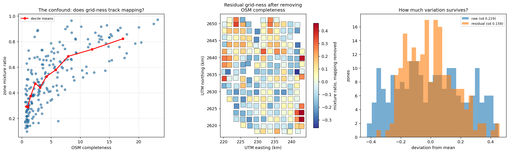

After regressing on log density: **79% of the between-zone spread survives** and stays
spatially coherent. But the relationship persists among well-mapped zones rather than
flattening, so density and planned development **cannot be fully separated using OSM
data alone**. The decorrelated residual, not the raw score, is the defensible quantity.

The same confound appears in the original clustering (cluster means 51.6 vs 544.3 nodes,
a **10.6× size ratio**), in the geometric fingerprint method, and in the articulation-point
statistics. It is a theme, not an isolated caveat.

### 5. The geometric fingerprint method was measuring density all along

UFFM compares street-bearing distributions. It has a real bug — bearings are circular but
were compared on a linear axis, so **rotating a real zone moves it further from itself
than a genuinely different zone lies**. Fixing that changes nothing.

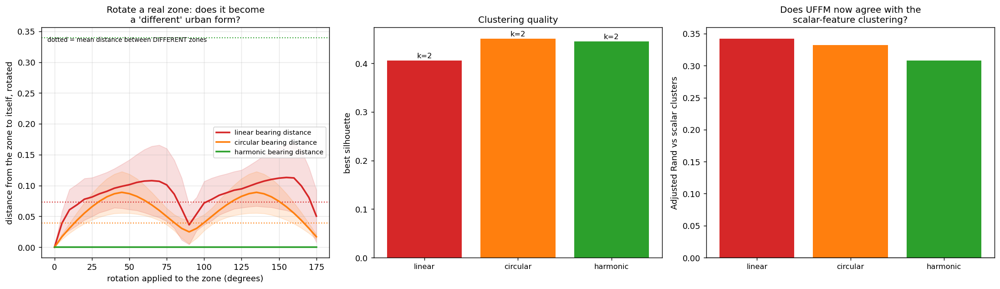

Across every variant, UFFM's clustering explains **36–49% of zone density** and **1–4% of
independently measured morphology**. Ablation locates the density in the angle and length
terms — denser fabric has shorter blocks and more four-way junctions, so both are density
proxies in geometric clothing.

### 6. The same betweenness rank means different things in different fabric

This is the framework's central proposition, and until a structural label existed at a
well-defined scale it could be argued but not tested.

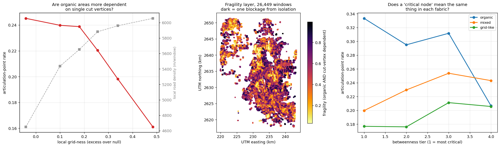

Critical nodes are **not** preferentially located in any fabric (p=0.49). What differs is
what they *are*:

| Local fabric | Articulation rate, top-1% BC | All nodes | Ratio | Fisher p |
|---|---|---|---|---|
| Organic | 0.333 | 0.237 | **1.40** | 0.049 |
| Mixed | 0.198 | 0.245 | 0.81 | 0.010 |
| Grid-like | 0.173 | 0.204 | 0.85 | 0.008 |

**In organic fabric the most critical nodes are 40% *more* likely to be cut vertices. In
grid fabric, 15% *less* likely. The sign reverses.**

In a grid, a high-betweenness node carries load *because it is well connected*, and
alternatives exist a block away. In organic fabric it carries load *because there is no
other way through*. **A critical node that is also a cut vertex cannot be helped by signal
retiming — there is no alternative path to shift traffic onto. Only added redundancy
helps.** Those two cases are indistinguishable in a centrality ranking.

*(The organic band rests on n=81 at p=0.049 and is indicative; the grid-like n=1,188 and
mixed n=575 bands carry the weight.)*

### 7. "Geometry and vulnerability are orthogonal" was a statement about the instrument

An earlier conclusion held that street geometry is unrelated to routing vulnerability.
The specific test behind it is sound — zone orientation entropy vs max betweenness,
r = +0.010, p = 0.776. The generalisation is not.

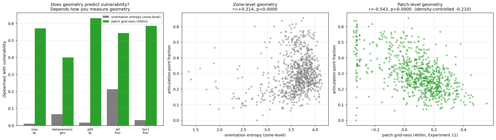

Using that *same* zone-level geometry measure, articulation-point fraction correlates at
**+0.214 (p<0.0001)**. And substituting the 400 m measure, **all five vulnerability
measures become significant** (partial |r| 0.14–0.21 after removing density) — patch-scale
is stronger on 5 of 5.

**A null result from a measure applied at the wrong scale is evidence about the measure,
not about the city.** That is the methodological thesis of this work, and it arrives here
from a fourth independent direction.

### 8. Validation: partial, and reported as such

The project set itself a target of 85% agreement with expert morphological assessment on
n=30. A first blind run **failed outright** (68.0% agreement, AUC 0.663, p=0.083) — and
the post-mortem traced it to an instrument defect: one response option covering both
"genuinely mixed" and "too little road to judge", which swallowed 46% of items.

A corrected, separately pre-registered run on 60 fresh patches:

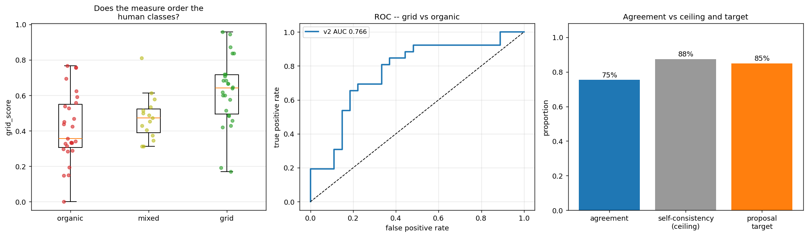

| | First run | Corrected run |
|---|---|---|
| "cannot judge" rate | 46% | **0%** |
| Self-consistency (ceiling) | 66.7% | **88%** |
| ROC AUC (primary) | 0.663 (p=0.083) | **0.766 (p=0.0005)** |
| Mean score ordering organic<mixed<grid | failed | **held** (0.419 / 0.476 / 0.620) |
| Agreement vs 85% target | 68.0% | **75.5% — not met** |

**Verdict: validated as a discriminator, not validated at the target.** And not fixable by
re-thresholding — the classes overlap, and the best accuracy at any single cut-point is
73.6%. It supports the aggregate city-scale uses above; it does not support per-patch
claims. **Both runs used a single labeller, so inter-rater reliability — what the expert
panel was for — remains unmeasured.**

---

## How these were established

Fifteen experiments, each logged with hypothesis, method, result and decision in
[`experiments/EXPERIMENTS.md`](experiments/EXPERIMENTS.md). Negative results are recorded
as negative.

| # | Experiment | Outcome |
|---|---|---|
| 01 | Permutation significance test | The 2-cluster split is real (p=0.005), not noise |
| 02 | Stable-features-only re-cluster | **Hypothesis rejected** — dropping unstable features made it worse |
| 03 | 2 km grid, full run | Partial support for the scale hypothesis |
| 04 | Scalar + UFFM feature fusion | No improvement |
| 05 | OSM-completeness filtering | No improvement |
| 06 | Decorrelate from zone size | **Key**: 10 of 23 features >50% size-explained; a real connectivity split survives |
| 07 | Satellite spot-check | 7/7 agreement — later shown unreliable by Exp 08 |
| 08 | CV/FFT pilot | **Null, and the null is the finding**: zones are mixtures |
| 09 | Patch-scale pilot | Mixture ratio is measurable at 400 m |
| 10 | Descriptor verification | **3 of 8 claims wrong**, caught before use |
| 11 | City-wide morphology map | 89,600 windows; mixture ratio varies between zones |
| 12 | UFFM rotation fix | **Hypothesis rejected** — UFFM is a density measure |
| 13 | Morphology × criticality | Principle 2 tested; the sign flips |
| 14 | Orthogonality recheck | The generalisation fails; the specific claim holds |
| 15 / 15b | Blind human validation | Failed, diagnosed, re-run; partial validation |

---

## What's here

```
dhaka_topology/          the pipeline package
  config.py                Config dataclass — bbox, grid size, every threshold, from YAML
  acquisition.py           Stage 1 — OSM download, cache, validate
  tiling.py                Stage 2 — buffered grid zone extraction
  features.py              Stage 3 — 26 topology features per zone
  clustering.py            Stage 4 — PCA + KMeans/DBSCAN/GMM, permutation test,
                            size decorrelation
  betweenness.py           Exact Brandes betweenness, 4-tier hierarchy, articulation points
  uffm.py                  Geometric fingerprints (see Finding 5 before using)
  visualization.py         plots
  pipeline.py              stage orchestration

experiments/             15 experiments, each with run.py + outputs + figures
  EXPERIMENTS.md           the running log — hypothesis / method / result / decision

results/
  figures/                 the 9 figures above, in argument order
  data/                    result tables worth citing
  original_v3_run_.../     the earlier 1km snapshot (see its README)

configs/                 one YAML per variant (v1, v3, v2km, thana)
tests/                   17 unit tests
compare_outputs.py       validates this pipeline against the original notebooks
```

**Use [`results/data/zone_morphology_decorrelated.csv`](results/data/)** as the zone-level
morphology variable — not the raw mixture ratio, for the reasons in Finding 4.

---

## Running it

```bash
pip install -r requirements.txt
python run_pipeline.py --config configs/v3.yaml --stage all
```

Stages run `acquire → tile → features → cluster → betweenness → uffm → plots`; each can be
run alone and reloads what it needs from disk.

```bash
pytest tests/
```

17 tests on the pure functions — Gini, orientation entropy, UFFM fingerprints,
betweenness/tier classification, and the rotation-invariance properties from Finding 2.

Any experiment re-runs standalone, e.g.:

```bash
python experiments/11_city_mixture_map/run.py
```

---

## Validation

The pipeline replaced six overlapping notebooks and is validated **bit-for-bit** against
them — every output diffed column-by-column over the same 827 zones.

| Stage | Output | Result |
|---|---|---|
| Features | `features.csv` (26 × 827), `features_normalized.csv` | **exact match** (±1e-6) |
| Clustering | `cluster_assignments.csv`, `clustering_scores.csv` | **exact match** |
| Betweenness | `all_zones_summary.csv`, `all_nodes_bc.csv` (822 zones) | **exact match** |
| UFFM | `uffm_fingerprints.csv`, `uffm_cluster_assignments.csv` | **exact match** |

Still runnable — the notebook-era reference outputs are in `../outputs/` and `../gat/`:

```bash
python compare_outputs.py \
  --old ../outputs/v3 --new results/original_v3_run_2026-09-17/outputs \
  --old-gat ../gat --new-gat results/original_v3_run_2026-09-17/gat
```

Last re-verified after the September 2026 cleanup: **ALL MATCH**.

**Not validated:** the `tile` stage against a fresh OSM download, and the `thana` zone
unit (out of scope by direction).

---

## Limitations

- **Validation is partial** (Finding 8). Supports aggregate city-scale conclusions, not
  per-patch claims about individual locations.
- **Inter-rater reliability is unmeasured.** One labeller across both runs.
- **Density and planned development are not fully separable** with OSM alone.
- **Coverage is not spatially uniform.** 30.4% of windows are too sparse to score, and
  their distribution is not random. Below ~1,500 m of road per 400 m window, human raters
  could not assign a morphology at all, so scores there are unverified.
- **Three archetypes, not four.** Radial has no stable angular signature (Finding 2).
- **Betweenness is zone-local** — computed per buffered subgraph, so raw magnitudes are
  not comparable across zones; only within-zone rank is used. **Articulation status is
  subgraph-dependent**, with 14.4% of nodes disagreeing between the zones containing them.
- **Policy implications are inference, not demonstration.** This measures structure. It
  does not measure intervention outcomes.
- **The graph attention neural component remains deferred**, as in the original framework.
  The betweenness here is exact and deterministic, not learned.
- **Two known bugs, both logged**: `uffm.py` compares circular bearings on a linear axis
  (a `uffm_bearing_metric` config option now offers corrected alternatives; the default
  stays `linear` to preserve bit-for-bit reproduction). `tiling.py`'s lon/lat bug is
  **fixed**.

## What's not here

Paper drafts, the LaTeX write-up and presentations are kept outside this repo. Raw OSM data
and per-zone intermediates are gitignored — large, and regenerable by running the pipeline.
